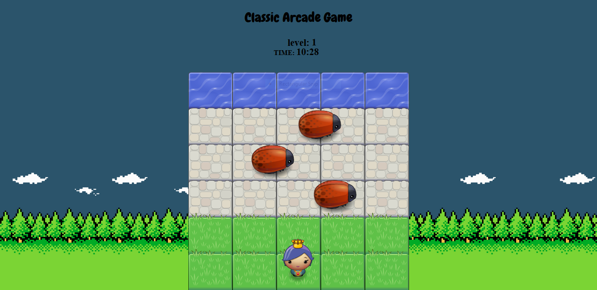
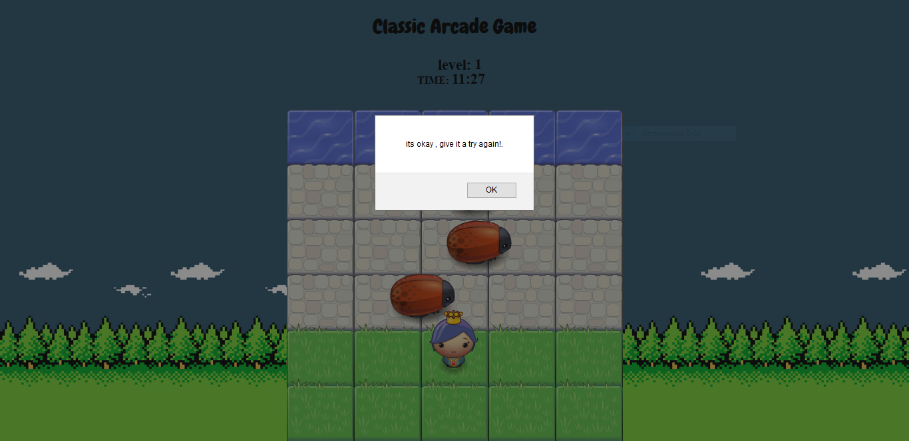
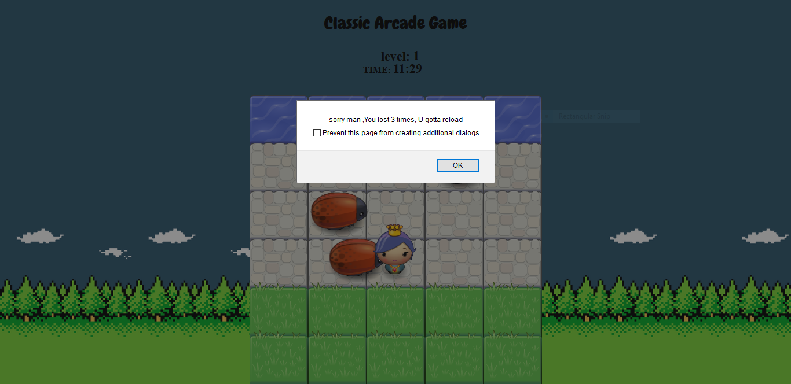

Frontend-nanodegree-arcade-game
===============================
#Game Overview
 classic arcade frogger  is the game in which the player reaches the end of the board while avoiding enemies. This game makes use of Object Oriented JavaScript to provide its functionality.

 ### How to Play
* Use arrow keys (up, down, left, right) to control the player movement.
* Navigate the player across the game and avoid colliding with the enemy bugs.
* Colliding with enemies will reset you back to the initial position.
* Your goal is to reach the river on top to win the game.

### Play the Game
* You can clone the repository and open 'index.html' to run the game locally. (or)
* You can checkout the game live using this [link](https://abhaydee.github.io/Classic-Arcade-Game/).

### Dependencies
* googlefonts [link](https://fonts.googleapis.com/css?family=Lato:300,400)

## Screenshots

&ensp;

&ensp;

&ensp;

## Developed By

Abhay Deshpande

[LinkedIn](https://linkedin.com/in/abhaydee)

## License

    Copyright 2018 Abhay Deshpande

    Licensed under the Apache License, Version 2.0 (the "License");
    you may not use this file except in compliance with the License.
    You may obtain a copy of the License at

        http://www.apache.org/licenses/LICENSE-2.0

    Unless required by applicable law or agreed to in writing, software
    distributed under the License is distributed on an "AS IS" BASIS,
    WITHOUT WARRANTIES OR CONDITIONS OF ANY KIND, either express or implied.
    See the License for the specific language governing permissions and
    limitations under the License.
